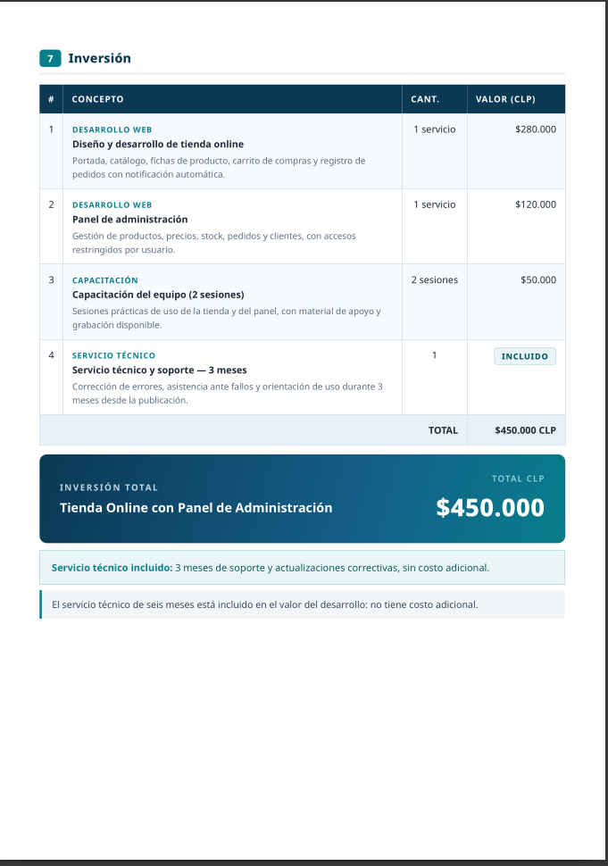
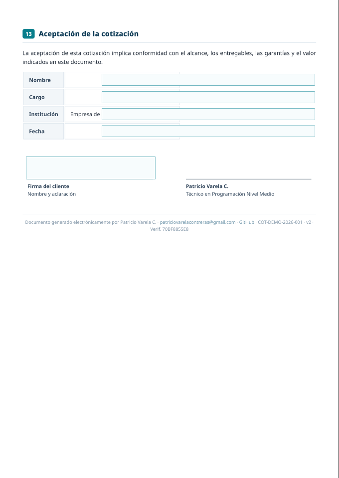

# Sistema Personal de Generación de Cotizaciones

Sistema profesional y reutilizable para crear **cotizaciones de servicios tecnológicos** en formato PDF, listo para enviar a clientes. Construido sobre **Google Sheets + Google Apps Script**, con un generador local opcional para previsualizar sin abrir el navegador.

> Caso real cargado: **COT-ECICEP-2026-001** — Desarrollo del *Sistema ECICEP Unificado* (CLP $120.000 · 6 meses de servicio técnico incluidos). Incluye además una **cotización demo ficticia** (`COT-DEMO-2026-001`) para capturas y pruebas.

---

## Objetivo

Reemplazar los informes técnicos improvisados (tipo Word) por un flujo profesional:

```
Datos (hojas) → Plantilla (HTML/CSS) → Documento → PDF en Drive
```

Pensado para cotizar durante años: desarrollo de software, automatizaciones con Google Apps Script, sistemas sobre Google Sheets, páginas web, soporte técnico, mantenimiento y servicios personalizados.

## Características

- **Numeración automática configurable**: `COT-ECICEP-2026-001` (patrón editable).
- **Identidad centralizada**: nombre, perfil, correo y contacto se cambian en una sola hoja (`CONFIG`) sin tocar código.
- **Plantilla visual v2** compartida entre Apps Script y el generador local:
  - Correo, teléfono, GitHub y ORCID como **links clicables** (encabezado y pie).
  - **QR de verificación** en la sección de vigencia: codifica el código del documento y su hash.
  - **Código de verificación** (`SHA-256` truncado con sal secreta) ligado a código + versión + fecha + monto: permite comprobar autenticidad y detectar alteraciones.
  - **Desglose justificado de la inversión**: cada ítem explica su precio.
  - Sección de **garantías y compromisos**: confidencialidad, respaldo Git/GitHub con copia del repositorio al término, corrección de errores, continuidad, entrega verificada, transparencia y sin cargos ocultos.
  - Ítems con precio $0 marcados como **INCLUIDO**.
- **PDF automático** guardado en Drive, con registro de URL y fecha.
- **Textos por defecto reutilizables** (soporte técnico, garantías, exclusiones, Git, condiciones de pago) sobrescribibles por cotización.
- **Formato simple de textos**: `# subtítulo`, `- lista`, `> nota`, `**negrita**`.
- **Registro LOG** de todas las operaciones.

## Estructura del repositorio

```
├── appsscript.json                  # Manifiesto de Apps Script
├── src/                             # Código Google Apps Script (.gs)
│   ├── Config.gs                    #   Constantes, esquema de hojas, lectores CONFIG/PLANTILLA
│   ├── Utils.gs                     #   Utilidades (markdown ligero, fechas, dinero, tokens)
│   ├── Hojas.gs                     #   Creación/reparación de las 6 hojas
│   ├── Semillas.gs                  #   Datos iniciales + cotización ECICEP
│   ├── Numeracion.gs                #   Códigos automáticos COT-XXXX-AÑO-NNN
│   ├── Clientes.gs                  #   Administración de clientes
│   ├── Cotizaciones.gs              #   Registro y creación de cotizaciones
│   ├── Plantilla.gs                 #   Motor de renderizado datos → HTML
│   ├── Pdf.gs                       #   Conversión a PDF y guardado en Drive
│   └── Menu.gs                      #   Menú "🧾 Cotizaciones" de la hoja
├── html/
│   ├── plantilla_cotizacion.html      # Plantilla v1 (clásica)
│   ├── plantilla_cotizacion_v2.html   # Plantilla v2: links + QR + desglose justificado
│   └── formulario_nueva_cotizacion.html  # Diálogo "Nueva cotización"
├── datos/                           # Datos versionables (seguros de publicar)
│   ├── config.json                  #   Identidad del prestador y opciones
│   ├── demo.json                    #   Cotización de PRUEBA (100% ficticia)
│   └── plantilla.json               #   Textos por defecto de presentación
├── datos/privado/                   # ⚠ NO versionado (.gitignore): clientes y cotizaciones REALES + secreto.json (sal del hash)
├── scripts/
│   └── generar_preview.py           # Generador local: JSON → HTML + PDF (WeasyPrint) + campos editables
├── preview/                         # ÚNICA carpeta de salida; el .gitignore solo publica los archivos *DEMO*
└── docs/
    ├── INSTALACION.md               # Montaje en Apps Script paso a paso
    └── ARQUITECTURA.md              # Modelo de datos y decisiones de diseño
```

## Instalación rápida (Google Apps Script)

1. Crea una **hoja de cálculo nueva** en Google Sheets.
2. Menú **Extensiones → Apps Script**.
3. Crea cada archivo de `src/` como **Archivo → Secuencia de comandos** (mismo nombre, sin `.gs`), y los dos archivos de `html/` como **Archivo → HTML**.
4. Copia también `appsscript.json` (Proyecto Settings → *Show manifest*).
5. Guarda, recarga la hoja y usa el menú **🧾 Cotizaciones**:
   - *Crear / reparar estructura*
   - *Cargar cotización ECICEP (inicial)* — o *Cargar cotización DEMO (ficticia)* para probar
   - *Generar PDF…*

Detalles completos en [`docs/INSTALACION.md`](docs/INSTALACION.md). Usuarios de `clasp`: ver nota al final de esa guía.

## Generador local (opcional)

Para previsualizar o regenerar los ejemplos sin abrir Google:

```bash
pip install weasyprint          # única dependencia externa
python3 scripts/generar_preview.py                    # cotizaciones REALES (requiere datos/privado/)
python3 scripts/generar_preview.py --demo             # cotización de PRUEBA
```

Todo se genera en `preview/` (carpeta única). El `.gitignore` publica **solo** los archivos `*DEMO*`; los documentos con datos reales quedan como archivos locales sin subir.

**Separación público/privado**: los datos reales viven en `datos/privado/` (gitignored). El generador usa automáticamente esa carpeta si existe. La sal del código de verificación se guarda en `datos/privado/secreto.json`; el documento demo se genera con una sal pública distinta para no ejercitar la tuya.

## Aceptación con datos del cliente

Si el cliente tiene nombre, cargo e institución registrados, la sección de aceptación se **imprime con sus datos** (sin campos rellenables encima); solo quedan campos editables para los espacios en blanco de la forma de pago. Con cliente incompleto, el documento sale con campos AcroForm para completar a mano.

## Uso diario

| Tarea | Dónde |
|---|---|
| Cambiar tu nombre/correo/vigencia/patrón de códigos | Hoja `CONFIG` |
| Registrar un cliente | Hoja `CLIENTES` |
| Crear cotización | Menú → *Nueva cotización…* |
| Completar resumen, alcance, entregables | Columnas de texto en hoja `COTIZACIONES` |
| Ajustar precio o agregar ítems | Hoja `ITEMS` |
| Emitir documento | Seleccionar fila → menú → *Generar PDF…* |

Los textos vacíos en la cotización usan automáticamente los valores por defecto de la hoja `PLANTILLA` (condiciones de pago "por acordar", exclusiones estándar, texto Git, etc.).

## Vista del documento (plantilla v2)

Capturas de la cotización de prueba (datos 100% ficticios), generadas con la plantilla v2:

| | |
|---|---|
|  |  |
|  |  |

## Mantenimiento

- La plantilla activa se elige con `plantilla_version` en `CONFIG` (`1` = clásica, `2` = links + QR + desglose). Los cambios estéticos se hacen en el archivo correspondiente de `html/` y benefician a ambos generadores.
- **La sal del código de verificación** (`hash_sal` en `CONFIG`) es secreta: si la cambias, los códigos de documentos anteriores dejan de validar. Guárdala fuera del repositorio si publicas el proyecto.
- El QR usa por defecto texto plano; si configuras `qr_base_url` (página propia de verificación), el QR apuntará a `{url}?c={código}&h={hash}`. En Apps Script la imagen se obtiene vía servicio externo (`api.qrserver.com`) protegido con try/catch: sin red, el PDF se genera igual, solo sin QR.
- Si agregas claves nuevas a `CONFIG`/`PLANTILLA`, actualiza `src/Semillas.gs` y `datos/*.json` en paralelo.
- El archivo `_Informe ASUS_HP 250 G5 M.G.docx` es **referencia histórica únicamente**: no forma parte del sistema y **no debe versionarse ni compartirse** (contiene datos personales de clientes).

## Git

El repositorio está preparado para conectarse a tu Git personal:

```bash
git remote add origin git@github.com:<usuario>/<repositorio>.git
git push -u origin main
```

No publiques nunca: credenciales, `.clasp.json` real, ni datos de clientes (ya excluidos vía `.gitignore`).
